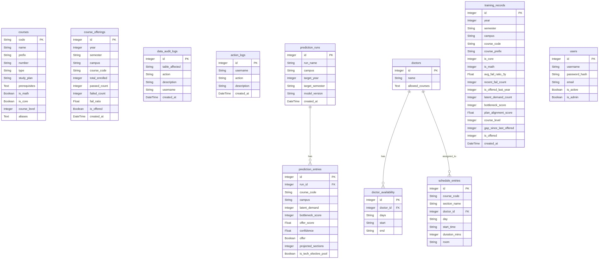

# CORS — Course Offering Recommendation System

> **Live Platform:** [cors-lau.vercel.app](https://cors-lau.vercel.app)  
> **API Documentation:** [cors-lau.vercel.app/docs](https://cors-lau.vercel.app/docs)

---

CORS is an intelligent academic planning platform built as a Capstone project at the Lebanese American University (LAU). It assists academic administrators in optimizing course offerings by combining historical enrollment data, cross-listing logic, prerequisite graph analysis, and a machine-learning recommendation engine to predict future section demand per campus (Beirut & Byblos).

---

## Table of Contents

- [Features](#features)
- [Tech Stack](#tech-stack)
- [Project Structure](#project-structure)
- [Local Setup](#local-setup)
- [Docker Setup](#docker-setup)
- [Environment Variables](#environment-variables)
- [API Endpoints](#api-endpoints)
- [ML Pipeline](#ml-pipeline)
- [Database ERD](#database-erd)

---

## Features

| Feature | Description |
|---|---|
| 🔐 **Authentication** | JWT-based login with role-based access (admin / standard user) |
| 📊 **Dashboard** | Overview cards with enrollment statistics and prediction summaries |
| 📁 **Data Management** | Upload, clean, and manage course, section, and enrollment records |
| 🤖 **Recommendation Engine** | ML-powered section demand predictions per campus |
| 🗺️ **Prerequisite Graph** | Interactive visual graph of course prerequisites |
| 🗓️ **Scheduler** | Drag-and-drop academic schedule builder |
| 👥 **User Management** | Admin panel for managing platform users |
| 📝 **Action Logs** | Full audit trail of all administrative actions |
| 🌙 **Dark / Light Mode** | System-aware theme with manual toggle |

---

## Tech Stack

### Backend
| Layer | Technology |
|---|---|
| Runtime | Python 3.12 |
| Framework | FastAPI 0.115 |
| Server | Uvicorn (ASGI) |
| ORM | SQLAlchemy 2.0 |
| Database | PostgreSQL 15 |
| Auth | PyJWT + Passlib (bcrypt) |
| ML | Scikit-learn, XGBoost, Pandas |
| Email | SendGrid |

### Frontend
| Layer | Technology |
|---|---|
| Framework | React 18 + TypeScript |
| Build Tool | Vite |
| Styling | Tailwind CSS |
| HTTP Client | Axios (via service layer) |
| Hosting | Vercel |

---

## Project Structure

```
CORS/
├── backend/
│   ├── Dockerfile                     # Backend container definition
│   ├── ai-engine/                     # Standalone ML training scripts
│   │   ├── beirut_code.py             # Beirut campus ML training pipeline
│   │   ├── byblos_code.py             # Byblos campus ML training pipeline
│   │   ├── models/                    # Trained model artifacts (.pkl, .txt)
│   │   └── *.ipynb                    # Jupyter notebooks for model exploration
│   └── api/
│       ├── requirements.txt           # Python dependencies
│       ├── migrate_crosslisted.py     # One-off cross-listing migration script
│       └── app/
│           ├── main.py                # FastAPI app entry point, middleware, lifespan
│           ├── core/
│           │   └── security.py        # Password hashing, JWT token utilities
│           ├── db/
│           │   ├── database.py        # SQLAlchemy engine & session factory
│           │   └── models.py          # ORM table definitions
│           ├── schemas/               # Pydantic request/response schemas
│           ├── crud/                  # Database CRUD operations
│           ├── services/
│           │   ├── ml_pipeline.py     # Ensemble model inference & auto-training
│           │   ├── ml_feature_transformer.py  # Feature engineering for ML input
│           │   ├── migration_service.py       # Course unification & cross-listing logic
│           │   ├── data_cleaner.py            # Upload data validation & sanitization
│           │   ├── section_planner.py         # Section count planning helpers
│           │   └── email_service.py           # SendGrid email notifications
│           └── api/
│               └── routers/
│                   ├── auth.py            # POST /auth/login, /auth/logout, /auth/me
│                   ├── data_management.py # GET/POST /data — upload & manage records
│                   ├── predictions.py     # POST /predict — run ML recommendations
│                   ├── scheduler.py       # GET/POST /scheduler — schedule management
│                   ├── graph.py           # GET /graph — prerequisite graph data
│                   ├── dashboard.py       # GET /dashboard — summary statistics
│                   ├── users.py           # GET/POST/DELETE /users — user management
│                   └── logs.py            # GET /logs — audit log retrieval
│
├── frontend/
│   ├── Dockerfile                     # Frontend container definition (Nginx)
│   ├── nginx.conf                     # Nginx SPA routing config
│   ├── vercel.json                    # Vercel deployment & /docs rewrite rules
│   ├── index.html                     # HTML entry point
│   ├── vite.config.ts                 # Vite build configuration
│   ├── tailwind.config.js             # Tailwind CSS theme configuration
│   └── src/
│       ├── main.tsx                   # React DOM entry point
│       ├── App.tsx                    # Root component, auth state, routing
│       ├── types/                     # Shared TypeScript type definitions
│       ├── hooks/
│       │   └── useNavigation.ts       # Client-side page navigation hook
│       ├── services/
│       │   └── api.ts                 # Centralized Axios API service layer
│       ├── data/                      # Static reference data (e.g. course lists)
│       ├── components/
│       │   ├── layout/
│       │   │   └── Sidebar.tsx        # Collapsible navigation sidebar
│       │   ├── charts/                # Reusable chart components
│       │   ├── scheduler/             # Scheduler-specific sub-components
│       │   └── ui/                    # Generic UI primitives (buttons, modals, etc.)
│       └── pages/
│           ├── LoginPage.tsx          # Authentication page
│           ├── Dashboard.tsx          # Summary statistics & quick actions
│           ├── DataManagement.tsx     # Data upload, view, and management
│           ├── RecommendationEngine.tsx  # ML prediction interface
│           ├── PrerequisiteGraph.tsx  # Interactive prerequisite visualizer
│           ├── Scheduler.tsx          # Academic schedule builder
│           ├── UsersManagement.tsx    # Admin user management panel
│           ├── UserSettings.tsx       # Profile & preference settings
│           └── ActionLogs.tsx         # Audit log viewer
│
├── docker-compose.yml                 # Orchestrates db + backend + frontend containers
├── database_erd.png                   # Entity Relationship Diagram (PNG)
└── erd.mmd                            # ERD source (Mermaid format)
```

---

## Local Setup

### Prerequisites

- **Python 3.12+**
- **Node.js 18+** and **npm**
- **PostgreSQL 15** running locally (or a connection string to a remote instance)

### 1. Clone the Repository

```bash
git clone https://github.com/Tarek-AL-Saleh/CORS.git
cd CORS
```

### 2. Backend

```bash
cd backend/api

# Create and activate virtual environment
python -m venv venv
# Windows
venv\Scripts\activate
# macOS / Linux
source venv/bin/activate

# Install dependencies
pip install -r requirements.txt

# Configure environment variables (see Environment Variables section)
cp .env.example .env   # then edit .env with your values

# Start the API server
uvicorn app.main:app --reload --port 8000
```

The API will be available at **http://localhost:8000**  
Interactive docs (Swagger UI) at **http://localhost:8000/docs**

### 3. Frontend

Open a **new terminal**:

```bash
cd frontend

# Install dependencies
npm install

# Start the development server
npm run dev
```

The frontend will be available at **http://localhost:5173**

---

## Docker Setup

Docker Compose orchestrates three services: **PostgreSQL**, **Backend (FastAPI)**, and **Frontend (Nginx)**.

### Prerequisites

- [Docker Desktop](https://www.docker.com/products/docker-desktop/) installed and running

### 1. Configure Environment

Create a `.env` file at the **project root** (next to `docker-compose.yml`):

```env
DB_USER=postgres
DB_PASSWORD=your_secure_password
DB_NAME=cors_db
SECRET_KEY=your_very_long_random_secret_key
ADMIN_USERNAME=admin
ADMIN_PASSWORD=your_admin_password
ADMIN_EMAIL=admin@example.com
FRONTEND_URL=http://localhost
```

### 2. Build and Start All Services

```bash
docker compose up --build
```

| Service | URL |
|---|---|
| Frontend | http://localhost |
| Backend API | http://localhost:8000 |
| API Swagger Docs | http://localhost:8000/docs |
| PostgreSQL | localhost:5432 |

### 3. Stop Services

```bash
docker compose down
```

To remove all data volumes as well:

```bash
docker compose down -v
```

---

## Environment Variables

The backend reads the following environment variables (set in `backend/.env` for local development or in `docker-compose.yml` for Docker):

| Variable | Required | Default | Description |
|---|---|---|---|
| `DATABASE_URL` | ✅ | — | Full PostgreSQL connection string |
| `SECRET_KEY` | ✅ | — | JWT signing secret (use a long random string) |
| `ADMIN_USERNAME` | ⬜ | `admin` | Bootstrap admin username |
| `ADMIN_PASSWORD` | ⬜ | `admin` | Bootstrap admin password |
| `ADMIN_EMAIL` | ⬜ | — | Bootstrap admin email |
| `FRONTEND_URL` | ⬜ | `http://localhost:5173` | Allowed CORS origin for the frontend |
| `SENDGRID_API_KEY` | ⬜ | — | SendGrid key for email notifications |
| `FORCE_DB_RESET` | ⬜ | `false` | Set to `true` to wipe and recreate all tables on startup |

---

## API Endpoints

All routes are prefixed under the base API URL. The full interactive reference is available at [cors-lau.vercel.app/docs](https://cors-lau.vercel.app/docs).

| Tag | Prefix | Description |
|---|---|---|
| Auth | `/auth` | Login, logout, current user (`/me`) |
| Data | `/data` | Upload, retrieve, and delete academic records |
| Predictions | `/predict` | Run ML-based section demand predictions |
| Scheduler | `/scheduler` | Build and retrieve academic schedules |
| Graph | `/graph` | Prerequisite graph data for visualization |
| Dashboard | `/dashboard` | Aggregated statistics for the overview page |
| Users | `/users` | Admin CRUD for platform user accounts |
| Logs | `/logs` | Read-only audit log access |

---

## ML Pipeline

The recommendation engine (`backend/api/app/services/ml_pipeline.py`) uses a **per-campus ensemble model**:

1. **Feature Engineering** — Historical enrollment data is transformed into structured features (year, semester, level, etc.) via `ml_feature_transformer.py`.
2. **Ensemble Model** — An XGBoost-based ensemble trained separately for **Beirut** and **Byblos** campuses, stored as `.pkl` files in `backend/ai-engine/models/`.
3. **Auto-Training** — On startup, if model files are missing (e.g. after a fresh deployment on ephemeral filesystems like Render), the pipeline automatically retrains from the database.
4. **Threshold Calculation** — Jupyter notebooks in `backend/ai-engine/` document the threshold calibration process used during model development.

---

## Database ERD



The ERD source is also available in Mermaid format at [`erd.mmd`](./erd.mmd).

---

## Deployment

| Component | Platform | URL |
|---|---|---|
| Frontend | Vercel | [cors-lau.vercel.app](https://cors-lau.vercel.app) |
| Documentation | Mintlify (proxied via Vercel) | [cors-lau.vercel.app/docs](https://cors-lau.vercel.app/docs) |
| Backend API | Render | Auto-deployed from `main` branch |
| Database | Render PostgreSQL | Managed instance |

---

## Authors

**Tarek AL-Saleh** & **Ayman Kacan** — Lebanese American University, CSC 599 Capstone Project with **Dr. Danielle Azar**
